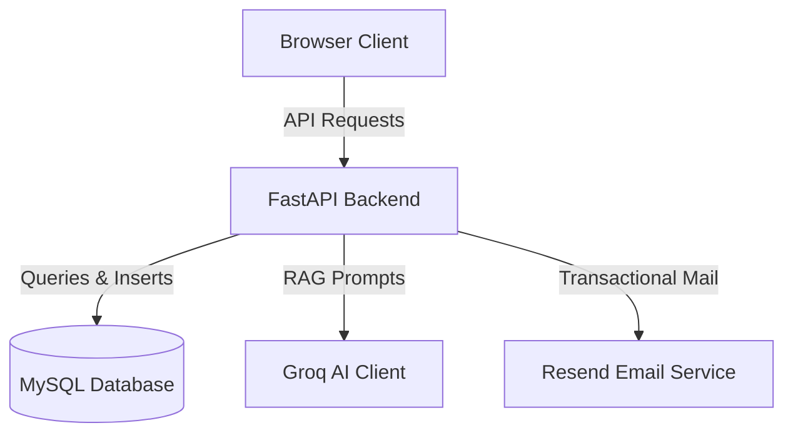

# Architecture Specification & Production Guide (A-Z)

This document serves as the master architectural specification and production readiness guide for the Likith Portfolio application ecosystem (Frontend, FastAPI Backend, MySQL DB, and Resend Integration).

---

## 1. System Architecture Overview

The application is structured as a decoupled client-server architecture:
*   **Client Layer**: A static frontend application served via Vercel (or Render), built using vanilla HTML5, Tailwind CSS, custom JavaScript utilities, and smooth scroll animations (Lenis).
*   **Application Layer**: A high-performance FastAPI backend hosted on Render, handling AI execution (Groq RAG), telemetry capture, and data intake.
*   **Data Persistence Layer**: An Aiven-managed MySQL cloud instance storing system telemetry, chat logs, and intake data.
*   **External Integrations**:
    *   **Groq Cloud API**: Low-latency execution of Llama 3 models for RAG.
    *   **Resend API**: Transactional confirmation email dispatch.

---

## 2. API Route Inventory

| Route Path | HTTP Method | Auth Required | Public / Private | Response Type | Description |
| :--- | :--- | :--- | :--- | :--- | :--- |
| `/` | `GET` | No | Public | `JSON` | Server status checks and baseline routing. |
| `/api/health` | `GET` | No | Public | `JSON` | Uptime statistics and temporal markers. |
| `/api/chat` | `POST` | No | Public | `Stream` | Event-stream responses powered by Groq and static RAG context. |
| `/api/collab` | `POST` | No | Public | `JSON` | Client ingestion of collaboration requests. |
| `/api/collab/verify` | `GET` | No | Public | `JSON` | Dormant endpoint for signature verification check. |
| `/api/analytics/visit` | `POST` | No | Public | `JSON` | Deduplicated visitor telemetry records. |
| `/api/admin/responses` | `GET` | Yes (`X-Admin-Token`) | Private | `JSON` | Ingested chat logs listing. |
| `/api/admin/collabs` | `GET` | Yes (`X-Admin-Token`) | Private | `JSON` | Collaboration request archives. |
| `/api/admin/visitors` | `GET` | Yes (`X-Admin-Token`) | Private | `JSON` | Visitor analytics metrics. |
| `/api/admin/visitor-stats` | `GET` | Yes (`X-Admin-Token`) | Private | `JSON` | High-level metrics summaries. |
| `/api/debug-db` | `GET` | No | Public | `JSON` | DB connectivity status check and diagnostic query. |

---

## 3. Communication Flows

### A. Frontend flow
1.  **Form Ingestion**: User enters info in `collab.html`.
2.  **Anti-Spam Validation**: Honeypot field (`_hp_field`) and interaction velocity checks are executed.
3.  **Human Verification Check**: The client passes a premium custom math challenge modal before validation succeeds.
4.  **Ingestion Request**: Payload containing tracking data (UTM, referrer) is dispatched via `fetch` to `/api/collab`.
5.  **Success Display**: A cinematic 3D rocket SVG launch is triggered using CSS/JS keyframes.

### B. Backend Flow
1.  **FastAPI Routing**: The route handler maps incoming JSON payloads directly to Pydantic objects (`CollabRequest`).
2.  **Telemetry Attachment**: UTM analytics are normalized to their corresponding SQLAlchemy model attributes.
3.  **One-Time Token Generation**: A cryptographically secure random token is generated via `secrets.token_urlsafe(32)` and its SHA-256 hash is computed.
4.  **Database Commit**: Stored with `pending` status.
5.  **Email Triggering**: Synchronous Resend API invocation, updating status to `sent` or `failed`.
6.  **Response Outflow**: The backend returns the `id` and `raw_token` to the client.

### C. Database Flow
1.  **Engine Lifecycle**: SQLAlchemy `create_engine` establishes pools to MySQL (Aiven) over TLS.
2.  **Session Lifecycle**: Connections are generated via `SessionLocal = sessionmaker()` on a per-request basis.
3.  **Deduplication Rules**: Telemetry uses a 5-minute cooldown window per `session_id` to prevent visitor logging duplication.

### D. Email Flow
1.  **Triggering**: Initiated during request execution.
2.  **Template Rendering**: An inline-styled HTML document containing internal IDs and branding elements is prepared.
3.  **Resend Dispatch**: Transmitted over HTTPS utilizing API keys loaded from env.
4.  **Status Syncing**: Commits the sending status (`sent`/`failed`) and error logs back to the database.

---

## 4. Navigation & Tracking Architecture

The platform uses a standardized, client-side tracking system via `navigation.js` and `analytics.js`:
*   **Source Parameterization**: URL configurations (e.g., `?source=agent`, `?source=nav`) are persisted dynamically during user navigation.
*   **Session Persistence**: Source parameters are stored in `sessionStorage` on page initialization.
*   **Smooth Navigation Anchors**: Smooth-scrolling targets are managed with Lenis animations mapped to URL hash structures (e.g., `#experience`).

---

## 5. Production Checklist

- [ ] Transition external API integrations (email dispatch, RAG completion) to asynchronous tasks (e.g. `BackgroundTasks`).
- [ ] Migrate raw database session lifecycle management to FastAPI `Depends` dependency injection.
- [ ] Apply format-level validation (e.g., `EmailStr` from Pydantic) to all intake endpoints.
- [ ] Align database SSL/TLS connection parameters with native PyMySQL context requirements.
- [ ] Implement rate-limiting rules (e.g., slowapi) on public endpoints (`/api/chat`, `/api/collab`).
- [ ] Clean up debug/diagnostic routes (`/api/debug-db`) before production deployment.
